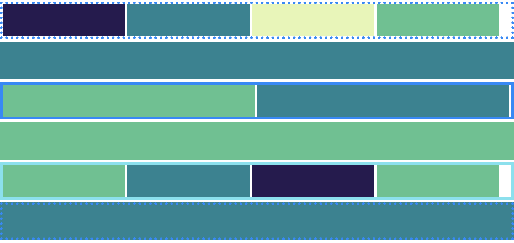

# 第二任务

## 你的任务

仅使用 div 重建下面的效果图。不需要其他 HTML 元素 — 所有的结构和样式都由你自己完成。

---

## 从哪里开始

布局一开始可能会让人感到无从下手。按照以下步骤来拆解它：

1. 从上到下观察效果图，数一数有多少行。每一行就是一个区块。
2. 为每一行创建一个父容器 div。
3. 观察每一行内部，数一数里面有多少个盒子或列。每一个就是该父元素内的一个子 div。
4. HTML 结构搭建完成后，开始编写你的 CSS 规则。

大多数布局都遵循某种网格规律。你的任务始终是一样的 — 先找出有多少行，再确定每行里面有什么。

---

## 建议

在触碰任何样式之前，先把结构搭好。先把 div 放到位，再添加 CSS。同时做两件事是大多数人卡住的原因。

---

## 参考资料

**Display 属性** — 控制元素在页面上如何渲染的 CSS 属性。常见的值包括 `block`（占据全部宽度）、`inline`（与文本并排显示）和 `inline-block`（并排显示但可以设置宽度和高度）。

**盒模型** — 描述元素所占空间的 CSS 模型。每个元素由四个层次从内到外组成：内容、内边距（边框内的空间）、边框和外边距（边框外的空间）。

**响应式单位** — 相对于其他参照物进行缩放的计量单位，而不是固定大小。例如 `vw`（视口宽度的百分比）、`vh`（视口高度的百分比）、`%`（父元素的百分比）和 `rem`（相对于根字体大小）。

**类选择器** — 使用 `class` 属性在 CSS 中定位 HTML 元素的方式。类在 HTML 中通过 `class="名称"` 定义，在 CSS 中通过 `.名称` 选择。多个元素可以共享同一个类。

**Div 元素** — 一个通用的块级 HTML 元素，用作容器来分组和组织其他元素。Div 默认没有任何视觉样式，通过 CSS 来应用布局和样式。

[w3schools properties list](https://www.w3schools.com/cssref/css3_pr_all.php)

---

## 效果图

